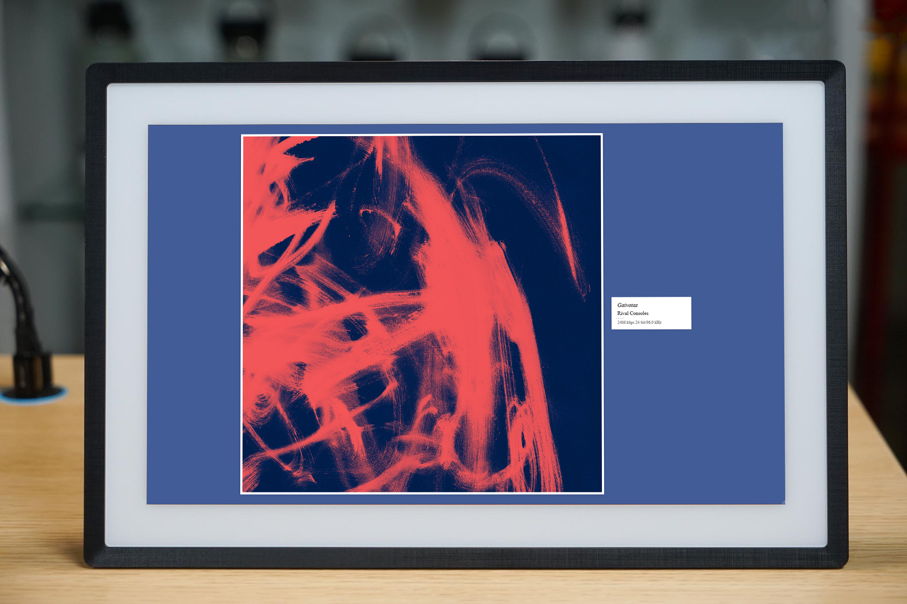
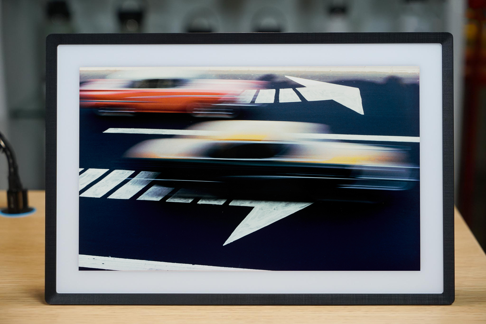

# WiiM Display

A fullscreen display application for WiiM audio streamers that shows album art and track information for Tidal streaming, with a slideshow mode for other sources. Perfect for dedicated displays, photo frames, or tablets mounted near your audio system.

## Features

- Beautiful fullscreen album art display with track information when playing from Tidal
- Automatic high-resolution slideshow when playing from other sources (Bluetooth, YouTube, etc.) or when nothing playing
- Gallery-style layout with artist/title information and audio quality details
- Automatic background color adaptation based on album art colors
- Simple installation on Raspberry Pi or any device that can run a web server
- Tested with WiiM Ultra, but should also work with WiiM Mini, WiiM Pro.

## Demo on a Lexar Plexar with Fully Kiosk Browser

| Tidal Playback | Slideshow |
|:--------------:|:-------------------------:|
|  |  |

## Hardware Requirements

- WiiM device (Mini, Pro, or Ultra) on your local network
- Display device (Raspberry Pi, old tablet, digital photo frame with browser)
- Local network connection between the two

## Quick Start

1. Clone this repository
   ```bash
   git clone https://github.com/claudiobrt/wiim-display.git
   cd wiim-display
   ```

2. Install dependencies
   ```bash
   npm install
   ```

3. Update the WiiM IP address in `proxy-server.js` 
   ```javascript
   // Find this line and replace with your WiiM's IP address
   const response = await fetch('/proxy?url=https://192.168.1.167/httpapi.asp?command=getPlayerStatus');
   ```

4. Start the proxy server
   ```bash
   npm run start-proxy
   ```

5. In another terminal, start the development server
   ```bash
   npm run dev
   ```

6. Open a browser to the URL shown in the terminal (usually `http://localhost:5173`)

7. For production use, build the application:
   ```bash
   npm run build
   ```

## Complete Raspberry Pi Setup Guide

### Hardware Needed

- Raspberry Pi (3B+ or newer recommended)
- MicroSD card (16GB+ recommended)
- Power supply
- Optional: Case with mounting solution
- Display (monitor, small TV, or dedicated screen)
- Network connection (Wi-Fi or Ethernet)

### 1. Set Up Raspberry Pi OS

1. Download and install [Raspberry Pi Imager](https://www.raspberrypi.com/software/) on your computer

2. Insert your MicroSD card and launch the Imager

3. Choose "Raspberry Pi OS Lite (64-bit)" (headless version without desktop)

4. Click the gear icon and configure:
   - Set hostname (e.g., `wiim-display`)
   - Enable SSH
   - Set username and password
   - Configure Wi-Fi (if not using Ethernet)
   - Set locale settings

5. Write the image to your SD card

6. Boot your Raspberry Pi with the SD card

### 2. Connect to Raspberry Pi and Update

1. Find your Pi's IP address from your router or using a network scanner

2. SSH into your Pi:
   ```bash
   ssh username@[your-pi-ip-address]
   ```

3. Update the system:
   ```bash
   sudo apt update
   sudo apt upgrade -y
   ```

### 3. Install Required Software

```bash
# Install Node.js and npm
curl -fsSL https://deb.nodesource.com/setup_18.x | sudo -E bash -
sudo apt install -y nodejs

# Install Git
sudo apt install -y git

# Install lightweight browser for kiosk mode
sudo apt install -y chromium-browser

# Install X server packages for display
sudo apt install -y xserver-xorg x11-xserver-utils xinit openbox

# Install tools for auto-start
sudo apt install -y lightdm
```

### 4. Clone and Set Up the WiiM Display Project

```bash
# Create a directory for the application
mkdir -p ~/apps
cd ~/apps

# Clone the repository
git clone https://github.com/claudiobrt/wiim-display.git
cd wiim-display

# Install dependencies
npm install

# Build the application
npm run build
```

### 5. Find Your WiiM Device IP Address

```bash
# Install network utilities
sudo apt install -y nmap

# Scan your network (replace with your network range)
nmap -sn 192.168.1.0/24

# Look for devices with "Linkplay" in their description
```

Note the IP address of your WiiM device and update it in the `proxy-server.js` file:

```bash
nano proxy-server.js
# Find and replace 192.168.1.167 with your WiiM's IP address
# Press Ctrl+X, then Y to save
```

### 6. Create a Service for the Proxy Server

Create a systemd service file:

```bash
sudo nano /etc/systemd/system/wiim-display.service
```

Add the following content:

```
[Unit]
Description=WiiM Display Proxy Server
After=network.target

[Service]
Type=simple
User=your_username
WorkingDirectory=/home/your_username/apps/wiim-display
ExecStart=/usr/bin/node proxy-server.js
Restart=on-failure
RestartSec=5

[Install]
WantedBy=multi-user.target
```

Save and exit (Ctrl+X, then Y)

Enable and start the service:

```bash
sudo systemctl enable wiim-display.service
sudo systemctl start wiim-display.service
```

### 7. Setup Auto-Start Browser in Kiosk Mode

Create an autostart file:

```bash
mkdir -p ~/.config/openbox
nano ~/.config/openbox/autostart
```

Add the following content:

```bash
# Wait for network
sleep 10

# Start Chromium in kiosk mode
chromium-browser --kiosk --disable-restore-session-state --disable-session-crashed-bubble --disable-infobars --app=http://localhost:3000 &

# Disable screen blanking and screensaver
xset s off
xset s noblank
xset -dpms
```

Make the file executable:

```bash
chmod +x ~/.config/openbox/autostart
```

### 8. Setup Samba for Easy Image Management

Install Samba to easily add and update slideshow images:

```bash
sudo apt install -y samba samba-common-bin

# Create a samba config file
sudo nano /etc/samba/smb.conf
```

Add the following to the end of the file:

```
[slideshow]
path = /home/your_username/apps/wiim-display/public/images
writeable = yes
guest ok = yes
create mask = 0777
directory mask = 0777
browseable = yes
```

Set up the Samba password:

```bash
sudo smbpasswd -a your_username
```

Restart Samba:

```bash
sudo systemctl restart smbd
```

Now you can access the slideshow folder from your computer by navigating to:
- Windows: `\\your_pi_ip_address\slideshow`
- Mac: `smb://your_pi_ip_address/slideshow`

### 9. Configure Auto-Start on Boot

Enable the display manager to start on boot:

```bash
sudo systemctl enable lightdm
```

### 10. Reboot and Test

```bash
sudo reboot
```

After rebooting, your Raspberry Pi should automatically start the browser in fullscreen mode and display your WiiM content.

## Adding Images for Slideshow

Add your images to the `public/images` folder:

- Directly copy files to this folder on your development machine during setup
- If using the Raspberry Pi setup, use the Samba share to add/update images
- Best results with images sized appropriately for your display resolution

## Customizing the Display

### Change Display Layout

Open `src/App.jsx` and modify the `horizontalView` state:

```javascript
// Change to false for vertical layout
const [horizontalView, setHorizontalView] = useState(true);
```

### Toggle Display Mode with Keyboard

When viewing the display in a browser, press the 'v' key to toggle between horizontal and vertical layout.

### Modify Slideshow Timing

In `src/components/StandbyMode/StandbyMode.jsx`, find the interval setting:

```javascript
// Change 30000 (30 seconds) to your desired value in milliseconds
timerRef.current = setInterval(() => {
  // ...
}, 30000);
```

## Troubleshooting

### Display Doesn't Show Any Content

1. Check that your WiiM device IP is correct in proxy-server.js
2. Ensure the proxy server is running (`npm run start-proxy`)
3. Verify your browser can access `http://[your-pi-ip]:3000`

### Slideshow Not Working

1. Check that you have images in the `public/images` folder
2. Ensure the images are in a supported format (JPG, PNG, GIF)
3. Verify file permissions allow read access

### WiiM Not Detected

1. Ensure your WiiM device is on the same network as your display device
2. Try restarting the WiiM device
3. Verify you can ping the WiiM device's IP address

### Display Flickering Between Modes

1. Restart the proxy server
2. Ensure your network connection is stable
3. Check for any error messages in the browser console

## Contributing

Contributions are welcome! Please feel free to submit a Pull Request.

## License

This project is licensed under the MIT License - see the LICENSE file for details.

## Acknowledgments

- Thanks to Linkplay/WiiM for their HTTP API documentation
- Built with React, Vite and Express